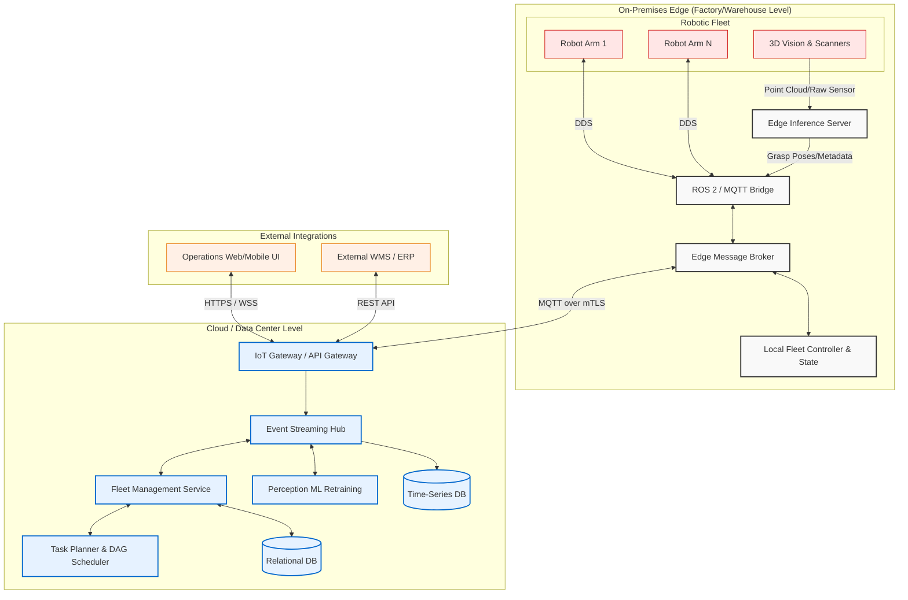

# 0. Multi-Robot Pick-and-Place Fleet Architecture

## 1. Architecture Overview

This proposed solution outlines a cloud-agnostic, microservices-based architecture designed to orchestrate a fleet of heterogeneous pick-and-place robots in a warehouse or manufacturing environment. To overcome network latency and bandwidth constraints associated with continuous video/3D perception streams, the system utilizes an **Edge-Cloud Hybrid** topology. 

Heavy computational tasks, such as point cloud processing, object segmentation, and local collision avoidance, are executed on an On-Premises Edge layer. The Edge layer maintains local state, ensuring the robotic fleet can continue operations even during temporary cloud disconnections. The Cloud layer serves as the central nervous system for global fleet management, long-term analytics, Directed Acyclic Graph (DAG)-based task scheduling, machine learning model retraining, and integrations with external systems like an Enterprise Resource Planning (ERP) or Warehouse Management System (WMS). 

## 2. Architecture Diagram

## 3. Well-Architected Framework Analysis

### Operational Excellence
* **Infrastructure as Code (IaC):** Both cloud infrastructure and edge Kubernetes clusters (e.g., k3s) are provisioned via declarative code, allowing rapid deployment to new warehouses.
* **Over-The-Air (OTA) Updates:** Robot control software, ROS 2 packages, and updated Edge AI perception models can be pushed continuously via centralized CI/CD pipelines down to the edge.
* **Observability:** Centralized logging and distributed tracing monitor the lifespan of a "pick task" from the WMS trigger down to the robotic actuator, enabling rapid debugging of dropped items or missed grasps.

### Security
* **Zero-Trust & mTLS:** Communication between the robots, the Edge broker, and the Cloud IoT Gateway requires strict authentication via Mutual TLS (mTLS), ensuring no rogue devices can issue control commands.
* **Network Segmentation:** The robotic fleet operates on an isolated operational technology (OT) network. Ingress/Egress is strictly mediated by the ROS 2/MQTT bridge and the Edge broker.
* **Role-Based Access Control (RBAC):** Fleet dashboard access is governed by strict RBAC and IAM policies, ensuring only authorized operators can modify task graphs or control the fleet.

### Reliability
* **Offline-First Resilience:** By maintaining a Local Fleet Controller and local message broker at the Edge, robots can continue executing their queued tasks and avoiding collisions even if the connection to the Cloud severs.
* **Fault-Tolerant Task Allocation:** If a robot arm experiences a hardware failure mid-task, the Cloud Task Allocator detects the heartbeat loss and automatically re-routes the task (and subsequent DAG dependencies) to a healthy, available robot.
* **Redundancy:** Cloud components are deployed across multiple Availability Zones, and event streams (e.g., Kafka) are replicated to prevent data loss.

### Performance Efficiency
* **Edge Intelligence:** Uploading raw 3D point clouds to the cloud for real-time robotic control is unfeasible. Instead, the Edge AI server processes heavy sensor data locally and only publishes lightweight geometric metadata (grasp poses, object IDs) to the message broker.
* **Event-Driven Architecture:** The system relies on asynchronous event streaming to handle high-throughput, low-latency telemetry from hundreds of joints and motors without bogging down synchronous REST APIs.
* **Protocol Optimization:** Utilizing MQTT and DDS ensures lightweight, publish-subscribe message passing with optimized Quality of Service (QoS) levels tuned for robotics.

### Cost Optimization
* **Tiered Data Storage:** Real-time, high-frequency telemetry is temporarily cached or kept in a warm Time-Series Database (TSDB). Older data is aggregated, down-sampled, and moved to cold blob storage for long-term analytics or compliance, saving database costs.
* **Compute Right-Sizing:** Fleet management microservices scale horizontally based on the factory's shift schedules. Cloud resources can automatically scale down during non-operational hours.
* **Bandwidth Savings:** Transmitting only processed JSON metadata (rather than video feeds) to the Cloud drastically reduces egress/ingress network transfer costs.

### Sustainability
* **Energy-Optimized Routing:** The Task Planner utilizes algorithms designed to minimize unnecessary robot travel paths and idle times, effectively lowering the power consumption of the fleet.
* **Compute Efficiency:** Running object detection locally via optimized Edge accelerators reduces the need for massive cloud GPU clusters running 24/7.
* **Hardware Longevity:** Predictive maintenance analytics, fueled by vibration and torque telemetry stored in the TSDB, prevents catastrophic hardware breakdowns, extending the lifecycle of the physical robotic assets.

## 4. Technical Glossary

* **ROS 2 (Robot Operating System 2):** An open-source middleware suite utilized for building robust robot applications. It handles hardware abstraction, low-level device control, and message-passing between processes.
* **DDS (Data Distribution Service):** The default real-time publish-subscribe communication protocol utilized by ROS 2 for inter-process and inter-robot communication.
* **Point Cloud:** A massive data set representing a 3D shape or object, typically generated by stereo cameras, structured light scanners, or LiDAR, used by the robot to understand depth and geometry.
* **DAG (Directed Acyclic Graph):** A mathematical modeling concept used by the Task Planner to represent tasks that must be executed in a specific sequence, ensuring that dependency requirements (e.g., "Box A must be picked before Box B") are strictly followed without entering infinite loops.
* **MQTT:** A lightweight, publish-subscribe messaging protocol designed specifically for constrained IoT devices and low-bandwidth, high-latency networks.
* **mTLS (Mutual Transport Layer Security):** A security process where both the client (e.g., a robot) and the server cryptographically verify each other's identity before establishing a connection.
* **Edge Computing:** A distributed computing paradigm that brings computation, data storage, and AI inference closer to the data source (the robots), reducing latency and bandwidth use.
* **TSDB (Time-Series Database):** A database optimized for ingesting, processing, and storing massive volumes of time-stamped data (telemetry, robot joint states, temperature readings) efficiently.
* **WMS (Warehouse Management System):** A software application used to control, manage, and optimize the day-to-day operations of a warehouse, including inventory tracking and order fulfillment.