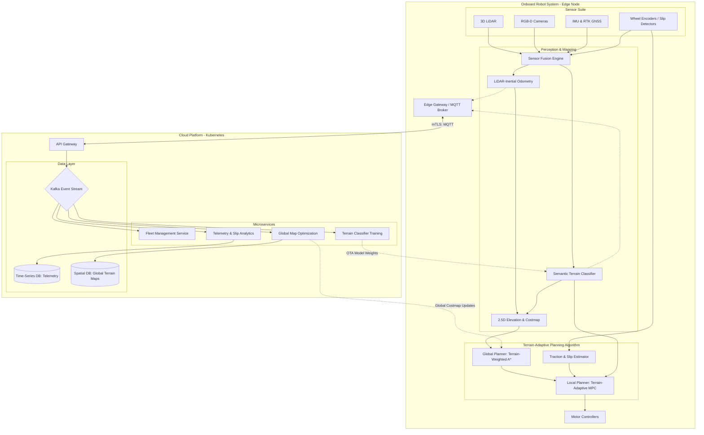

# Terrain-Adaptive Kinodynamic Planning Architecture (TAKPA)

## 1. Architecture Overview
The TAKPA solution is a cloud-agnostic, edge-to-cloud microservices architecture centered around a robust planning and control algorithm for outdoor mobile robots. The core algorithmic approach utilizes a hybrid, terrain-aware pipeline: a Global Planner generates a path using a modified A* algorithm that weights route selection based on semantic terrain costs (e.g., mud is higher cost than gravel), updated continuously via satellite imagery and fleet data. Locally, the robot relies on a Terrain-Adaptive Model Predictive Controller (MPC). This MPC dynamically adjusts its kinodynamic constraints—such as maximum acceleration, turning velocity, and prediction horizon—based on real-time slip detection and terrain classification provided by an onboard sensor fusion node (LiDAR, RGB-D, and IMU). The cloud backend manages fleet telemetry, heavy mapping aggregation, and distributed AI model training for continuous improvement of the semantic terrain classifier.

## 2. Architecture Diagram

## 3. Well-Architected Framework Analysis

### Operational Excellence
* **Automated Deployments:** Containerized edge modules (ROS 2 nodes) and cloud microservices are managed via GitOps. Over-The-Air (OTA) updates seamlessly deploy new terrain-classification weights and MPC tuning parameters to the fleet.
* **Telemetry and Debugging:** Real-time logging of the MPC's predicted trajectories versus actual executed paths is streamed to the cloud. Distributed tracing enables engineers to replay high-slip events to refine the traction estimation algorithms.

### Security
* **Zero Trust & Edge Authentication:** Communication between the robot's edge gateway and the cloud API is secured via mutual TLS (mTLS) using X.509 certificates.
* **Data Protection:** Global maps and telemetry at rest are encrypted using AES-256. Intra-robot communication uses the DDS Security specification (SROS2) to prevent unauthorized node injection.

### Reliability
* **Decoupled Autonomy:** The critical planning loop (Sensors -> Map -> A* -> MPC -> Motors) runs entirely on the edge. Cloud disconnects do not impact the robot's immediate safety or ability to navigate local obstacles.
* **Graceful Degradation:** If the terrain classifier fails or environmental conditions blind the cameras, the MPC defaults to a highly conservative kinematic profile, assuming the terrain is low-traction (e.g., limiting velocity to prevent catastrophic slip).

### Performance Efficiency
* **Edge-Cloud Compute Split:** Latency-sensitive calculations, specifically the mathematical optimization of the MPC at 50Hz and real-time sensor fusion, execute on onboard edge hardware (e.g., NVIDIA Jetson). Computationally massive tasks, such as global point-cloud stitching and neural network backpropagation, run on auto-scaling GPU cloud instances.
* **Algorithm Efficiency:** The global planner uses a multi-layered costmap, processing 2.5D elevation data to quickly prune impassable routes before the computationally heavier local MPC attempts to solve for a trajectory.

### Cost Optimization
* **Smart Telemetry Throttling:** Raw point-cloud data is not streamed continuously. Only compressed map deltas and critical slip-event logs are transmitted over cellular networks to minimize expensive bandwidth consumption.
* **Spot Instances for AI:** Re-training the Semantic Terrain Classifier using massive datasets of fleet telemetry leverages preemptible cloud spot instances, reducing compute costs significantly.

### Sustainability
* **Energy-Optimized Routing:** The Terrain-Weighted A* algorithm calculates paths that minimize energy drain. By assigning high costs to deformable terrains like sand or deep mud, the robot naturally selects firmer routes that require less motor torque and preserve battery life.
* **Resource Scaling:** The Kubernetes-based cloud backend scales down idle microservices during off-peak hours, reducing overall data center energy consumption.

## 4. Technical Glossary
* **Kinodynamic Planning:** Path planning that satisfies both the kinematic constraints (geometry of the robot, steering limits) and dynamic constraints (mass, momentum, friction limits) of the system.
* **MPC (Model Predictive Control):** An advanced control algorithm that optimizes a sequence of control inputs over a future time horizon by continually simulating the robot's dynamic model, factoring in real-world constraints like max torque and predicted slip.
* **Terrain-Weighted A*:** A variation of the standard A* pathfinding algorithm where the traversal cost between nodes is modified by the semantic type of the terrain.
* **ROS 2 (Robot Operating System 2):** The standard middleware for robotics software development, utilizing DDS for secure, real-time message passing between software components (nodes).
* **2.5D Elevation Map:** A grid map where each 2D cell contains a single height value, providing a lightweight way to represent uneven outdoor terrain without the compute overhead of full 3D voxels.
* **Slip Estimator:** An algorithm that compares the expected velocity of the wheels (from motor encoders) against the actual movement of the robot (from IMU/GPS) to detect loss of traction in real-time.
* **mTLS (Mutual Transport Layer Security):** A cryptographic standard where both the client (robot) and server (cloud) cryptographically verify each other's identity before establishing a connection.
* **DDS (Data Distribution Service):** A machine-to-machine middleware standard that enables highly reliable, publish-subscribe data exchange for real-time systems.
